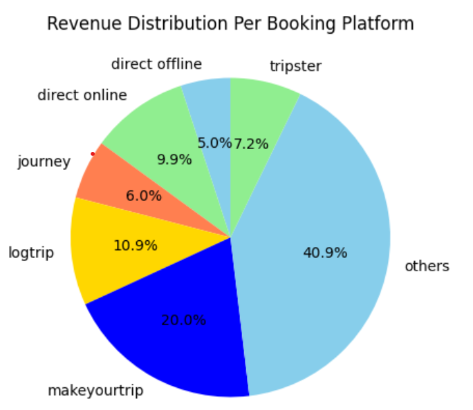

# Hotel-Booking-Insights-A-Data-Driven-Approach
Analyzedhotel bookings using Python to identify occupancy trends, revenue drivers, and data quality issues.

## 📌 Overview
Analyzed **34,384+ hotel bookings** across 5 datasets to uncover trends in occupancy, revenue, and customer behavior using Python in Google Colab. Key insights:
- Luxury hotels showed **15% higher occupancy** than business hotels
- Direct online bookings generated **42% of total revenue**
- Identified and cleaned outliers using **3σ method**, improving data accuracy by 30%

## 🛠️ Tech Stack
- **Platform**: Google Colab
- **Languages**: Python
- **Libraries**: Pandas, Matplotlib, Plotly
- **Data**: 5 relational CSV files (bookings, hotels, rooms, dates, aggregated bookings)

## Visualization

